

<section>
   <h1>Introducción a la visualización de datos con Apache Superset</h1>
    

        

             
        

        

             
        

    

</section>

---

<section data-marpit-fragments="9">
    

        

            <h1>Conceptos básicos</h1>
            

                <ul>
                    <li data-marpit-fragment="1">Datos</li>
                    <li data-marpit-fragment="2">Software</li>
                    <ol>
                        <li class="lista"></li>
                        <ol style="font-size: 1.5rem">
                            <li data-marpit-fragment="3">Ejecución irrestricta</li>
                            <li data-marpit-fragment="4">Acceso irrestricto al código fuente</li>
                            <li data-marpit-fragment="5">Inspección exhaustiva de los mecanismos de funcionamiento</li>
                            <li data-marpit-fragment="6">Adaptación para uso y necesidades de usuarias/os</li>
                            <li data-marpit-fragment="7">Libertad de estudio de funcionamiento</li>
                            <li data-marpit-fragment="8">Confección y distribución pública de copias</li>
                            <li data-marpit-fragment="9">Modificación del programa y distribución libre</li>
                        </ol>
                    </ol>
                </ul>
            

        

    

</section>

---

<section>

    

   <h1>Conceptos básicos</h1>
    

    <ul>
        <li >Datos</li>
        <li >Software</li>
        <ol>
            <li data-marpit-fragment="1">Software Libre</li>   
            <ol style="font-size: 1.5rem">
                <li >Ejecución irrestricta</li>
                <li >Acceso irrestricto al código fuente</li>
                <li >Inspección exhaustiva de los mecanismos de funcionamiento</li>
                <li >Adaptación para uso y necesidades de usuarias/os</li>
                <li >Libertad de estudio de funcionamiento</li>
                <li >Confección y distribución pública de copias</li>
                <li >Modificación del programa y distribución libre</li>
            </ol>
        </ol>
    </ul>
    

    

    

</section>

---

<section data-marpit-fragments="3">
    

        

            
        

        

            
        

        

            
        

    

</section>

---

<section>
    

        

            

                <h1>Ordenanza nro 11063</h1>
                

                    <embed src="./Ordenanza_11063.pdf" type="application/pdf" width="100%"  />
                

            

        

    

</section>

---

<section>
    

        <h1>Análisis y visualización de datos</h1>
    

</section>

---

<section>
    

        

            <h1>Principios de diseño y narrativa visual para comunicar patrones, tendencias y anomalías.</h1>
            <h3>Knaflic (2015)</h3>
        

        

            <ul>
                <li>Comprender el contexto.</li>
                <li>Elegir una visualización efectiva.</li>
                <li>Eliminar el desorden.</li>
                <li>Enfocar la atención de la audiencia.</li>
                <li>Pensar como un/a Diseñador/a.</li>
                <li>Contar una historia.</li>
            </ul>
        

    

</section>

---

<section>
    

    

        <h1>Principios de diseño y narrativa visual para comunicar patrones, tendencias y anomalías.</h1>
        <h3>Knaflic (2015)</h3>
    

        

            

                

                    <ul>
                        <li><strong>Comprender el contexto.</strong></li>
                        <li>Elegir una visualización efectiva.</li>
                        <li>Eliminar el desorden.</li>
                        <li>Enfocar la atención de la audiencia.</li>
                        <li>Pensar como un/a Diseñador/a.</li>
                        <li>Contar una historia.</li>
                    </ul>
                

            

            

                

                        <ul>
                            <li>Quién (Su Audiencia)</li>
                            <li>Qué (Acción)</li>
                            <li>Cómo (Mecanismo y Tono)</li>
                            <ol data-marpit-fragment="2">
                                <li>La historia de 3 minutos</li>
                                <li>La Gran idea</li>
                                <li>Storyboarding</li>
                            </ol>
                        </ul>
                    

                

            

        

    

</section>

---

<section>

    

        <h1>Principios de diseño y narrativa visual para comunicar patrones, tendencias y anomalías.</h1>
        <h3>Knaflic (2015)</h3>
    

    

        

            <ul>
                <li>Comprender el contexto.</li>
                <li><strong>Elegir una visualización efectiva.</strong></li>
                <li>Eliminar el desorden.</li>
                <li>Enfocar la atención de la audiencia.</li>
                <li>Pensar como un/a Diseñador/a.</li>
                <li>Contar una historia.</li>
            </ul>
        

        

            

                

                    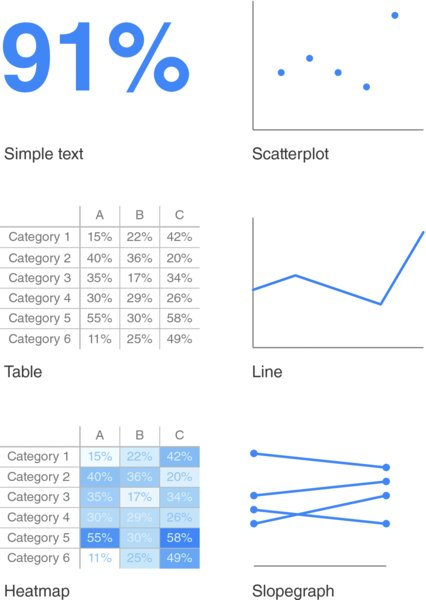
                

            

        

    

</section>

---

<section>

    

        <h1>Principios de diseño y narrativa visual para comunicar patrones, tendencias y anomalías.</h1>
        <h3>Knaflic (2015)</h3>
    

    

        

            <ul>
                <li>Comprender el contexto.</li>
                <li><strong>Elegir una visualización efectiva.</strong></li>
                <li>Eliminar el desorden.</li>
                <li>Enfocar la atención de la audiencia.</li>
                <li>Pensar como un/a Diseñador/a.</li>
                <li>Contar una historia.</li>
            </ul>
        

        

            

                

                    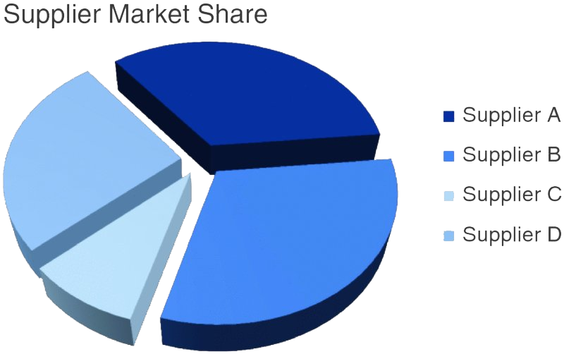
                

            

        

    

</section>

---

<section>

    

        <h1>Principios de diseño y narrativa visual para comunicar patrones, tendencias y anomalías.</h1>
        <h3>Knaflic (2015)</h3>
    

    

        

            <ul>
                <li>Comprender el contexto.</li>
                <li><strong>Elegir una visualización efectiva.</strong></li>
                <li>Eliminar el desorden.</li>
                <li>Enfocar la atención de la audiencia.</li>
                <li>Pensar como un/a Diseñador/a.</li>
                <li>Contar una historia.</li>
            </ul>
        

        

            

                

                    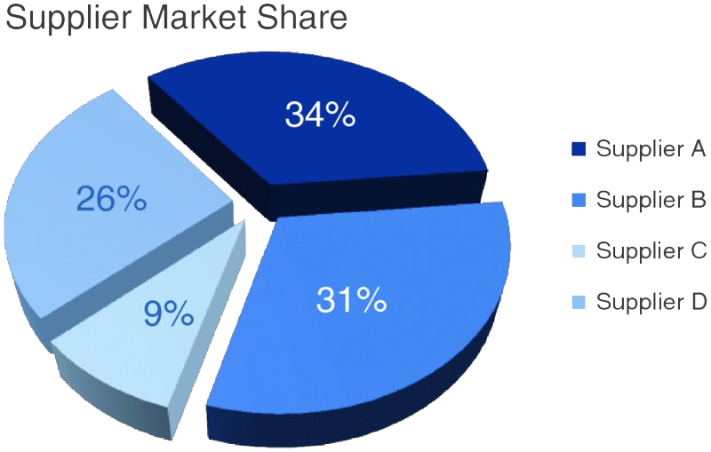
                

            

        

    

</section>

---

<section>

    

        <h1>Principios de diseño y narrativa visual para comunicar patrones, tendencias y anomalías.</h1>
        <h3>Knaflic (2015)</h3>
    

    

        

            <ul>
                <li>Comprender el contexto.</li>
                <li><strong>Elegir una visualización efectiva.</strong></li>
                <li>Eliminar el desorden.</li>
                <li>Enfocar la atención de la audiencia.</li>
                <li>Pensar como un/a Diseñador/a.</li>
                <li>Contar una historia.</li>
            </ul>
        

        

            

                

                    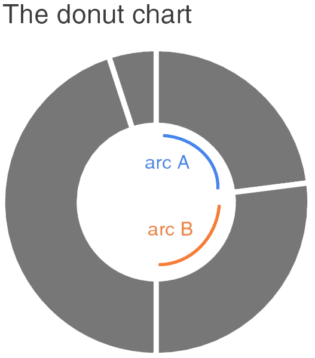
                

            

        

    

</section>

---

<section>

    

        <h1>Principios de diseño y narrativa visual para comunicar patrones, tendencias y anomalías.</h1>
        <h3>Knaflic (2015)</h3>
    

    

        

            <ul>
                <li>Comprender el contexto.</li>
                <li><strong>Elegir una visualización efectiva.</strong></li>
                <li>Eliminar el desorden.</li>
                <li>Enfocar la atención de la audiencia.</li>
                <li>Pensar como un/a Diseñador/a.</li>
                <li>Contar una historia.</li>
            </ul>
        

        

            

                

                    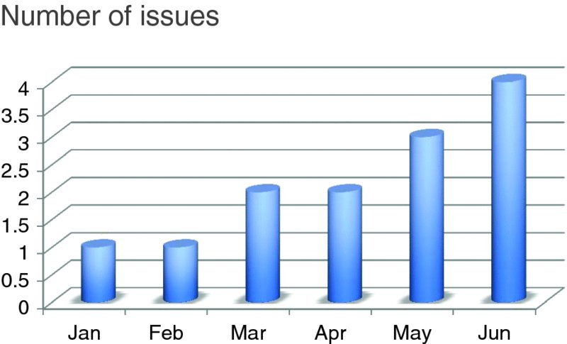
                

            

        

    

</section>

---

<section>

    

        <h1>Principios de diseño y narrativa visual para comunicar patrones, tendencias y anomalías.</h1>
        <h3>Knaflic (2015)</h3>
    

    

        

            <ul>
                <li>Comprender el contexto.</li>
                <li><strong>Elegir una visualización efectiva.</strong></li>
                <li>Eliminar el desorden.</li>
                <li>Enfocar la atención de la audiencia.</li>
                <li>Pensar como un/a Diseñador/a.</li>
                <li>Contar una historia.</li>
            </ul>
        

        

            

                

                    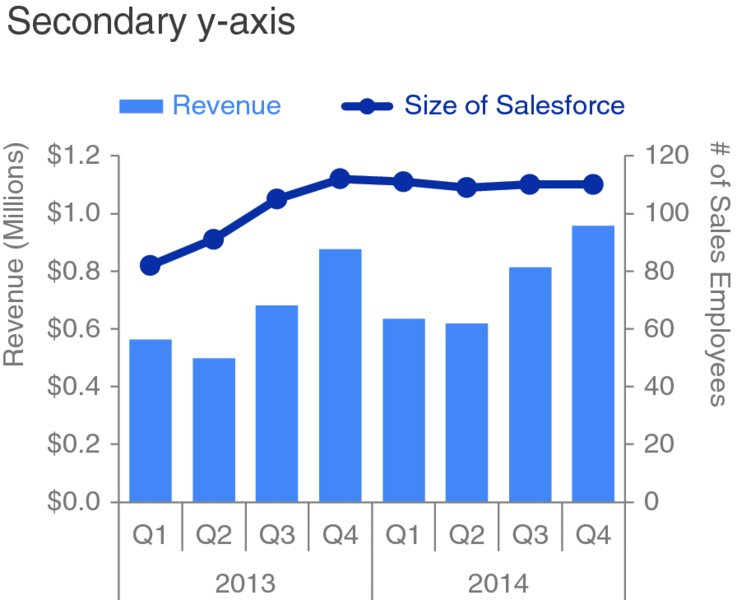
                

            

        

    

</section>

---

<section>

    

        <h1>Principios de diseño y narrativa visual para comunicar patrones, tendencias y anomalías.</h1>
        <h3>Knaflic (2015)</h3>
    

    

        

            <ul>
                <li>Comprender el contexto.</li>
                <li><strong>Elegir una visualización efectiva.</strong></li>
                <li>Eliminar el desorden.</li>
                <li>Enfocar la atención de la audiencia.</li>
                <li>Pensar como un/a Diseñador/a.</li>
                <li>Contar una historia.</li>
            </ul>
        

        

            

                

                                    
                    
                    
                    
                

            

        

    

</section>

---

<section>

    

        <h1>Principios de diseño y narrativa visual para comunicar patrones, tendencias y anomalías.</h1>
        <h3>Knaflic (2015)</h3>
    

    

        

            <ul>
                <li>Comprender el contexto.</li>
                <li>Elegir una visualización efectiva.</li>
                <li><strong>Eliminar el desorden.</strong></li>
                <li>Enfocar la atención de la audiencia.</li>
                <li>Pensar como un/a Diseñador/a.</li>
                <li>Contar una historia.</li>
            </ul>
        

        

            

                

                    
<strong>Principios Gestalt de la percepción visual</strong>

                

                

                    
                    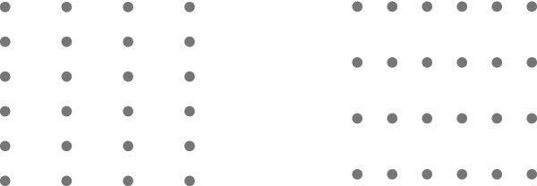
                

            

        

    

</section>

---

<section>

    

        <h1>Principios de diseño y narrativa visual para comunicar patrones, tendencias y anomalías.</h1>
        <h3>Knaflic (2015)</h3>
    

    

        

            <ul>
                <li>Comprender el contexto.</li>
                <li>Elegir una visualización efectiva.</li>
                <li><strong>Eliminar el desorden.</strong></li>
                <li>Enfocar la atención de la audiencia.</li>
                <li>Pensar como un/a Diseñador/a.</li>
                <li>Contar una historia.</li>
            </ul>
        

        

            

                

                    
<strong>Principios Gestalt de la percepción visual</strong>

                

                

                    
                    
                

            

        

    

</section>

---

<section>

    

        <h1>Principios de diseño y narrativa visual para comunicar patrones, tendencias y anomalías.</h1>
        <h3>Knaflic (2015)</h3>
    

    

        

            <ul>
                <li>Comprender el contexto.</li>
                <li>Elegir una visualización efectiva.</li>
                <li><strong>Eliminar el desorden.</strong></li>
                <li>Enfocar la atención de la audiencia.</li>
                <li>Pensar como un/a Diseñador/a.</li>
                <li>Contar una historia.</li>
            </ul>
        

        

            

                

                    
<strong>Principios Gestalt de la percepción visual</strong>

                

                

                    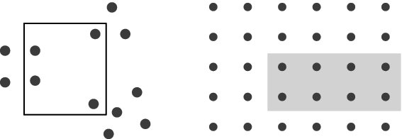
                

            

        

    

</section>

---

<section>

    

        <h1>Principios de diseño y narrativa visual para comunicar patrones, tendencias y anomalías.</h1>
        <h3>Knaflic (2015)</h3>
    

    

        

            <ul>
                <li>Comprender el contexto.</li>
                <li>Elegir una visualización efectiva.</li>
                <li><strong>Eliminar el desorden.</strong></li>
                <li>Enfocar la atención de la audiencia.</li>
                <li>Pensar como un/a Diseñador/a.</li>
                <li>Contar una historia.</li>
            </ul>
        

        

            

                

                    
<strong>Principios Gestalt de la percepción visual</strong>

                

                

                    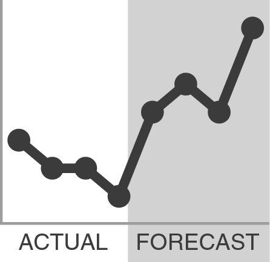
                

            

        

    

</section>

---

<section>

    

        <h1>Principios de diseño y narrativa visual para comunicar patrones, tendencias y anomalías.</h1>
        <h3>Knaflic (2015)</h3>
    

    

        

            <ul>
                <li>Comprender el contexto.</li>
                <li>Elegir una visualización efectiva.</li>
                <li><strong>Eliminar el desorden.</strong></li>
                <li>Enfocar la atención de la audiencia.</li>
                <li>Pensar como un/a Diseñador/a.</li>
                <li>Contar una historia.</li>
            </ul>
        

        

            

                

                    
<strong>Principios Gestalt de la percepción visual</strong>

                

                

                    
                

            

        

    

</section>

---

<section>

    

        <h1>Principios de diseño y narrativa visual para comunicar patrones, tendencias y anomalías.</h1>
        <h3>Knaflic (2015)</h3>
    

    

        

            <ul>
                <li>Comprender el contexto.</li>
                <li>Elegir una visualización efectiva.</li>
                <li><strong>Eliminar el desorden.</strong></li>
                <li>Enfocar la atención de la audiencia.</li>
                <li>Pensar como un/a Diseñador/a.</li>
                <li>Contar una historia.</li>
            </ul>
        

        

            

                

                    
<strong>Principios Gestalt de la percepción visual</strong>

                

                

                    
                

            

        

    

</section>

---

<section>

    

        <h1>Principios de diseño y narrativa visual para comunicar patrones, tendencias y anomalías.</h1>
        <h3>Knaflic (2015)</h3>
    

    

        

            <ul>
                <li>Comprender el contexto.</li>
                <li>Elegir una visualización efectiva.</li>
                <li><strong>Eliminar el desorden.</strong></li>
                <li>Enfocar la atención de la audiencia.</li>
                <li>Pensar como un/a Diseñador/a.</li>
                <li>Contar una historia.</li>
            </ul>
        

        

            

                

                    
<strong>Principios Gestalt de la percepción visual</strong>

                

                

                    
                

            

        

    

</section>

---

<section>

    

        <h1>Principios de diseño y narrativa visual para comunicar patrones, tendencias y anomalías.</h1>
        <h3>Knaflic (2015)</h3>
    

    

        

            <ul>
                <li>Comprender el contexto.</li>
                <li>Elegir una visualización efectiva.</li>
                <li><strong>Eliminar el desorden.</strong></li>
                <li>Enfocar la atención de la audiencia.</li>
                <li>Pensar como un/a Diseñador/a.</li>
                <li>Contar una historia.</li>
            </ul>
        

        

            

                

                    
<strong>Principios Gestalt de la percepción visual</strong>

                

                

                    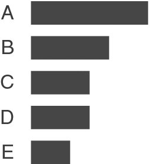
                

            

        

    

</section>

---

<section>

    

        <h1>Principios de diseño y narrativa visual para comunicar patrones, tendencias y anomalías.</h1>
        <h3>Knaflic (2015)</h3>
    

    

        

            <ul>
                <li>Comprender el contexto.</li>
                <li>Elegir una visualización efectiva.</li>
                <li><strong>Eliminar el desorden.</strong></li>
                <li>Enfocar la atención de la audiencia.</li>
                <li>Pensar como un/a Diseñador/a.</li>
                <li>Contar una historia.</li>
            </ul>
        

        

            

                

                    
<strong>Principios Gestalt de la percepción visual</strong>

                

                

                    
                    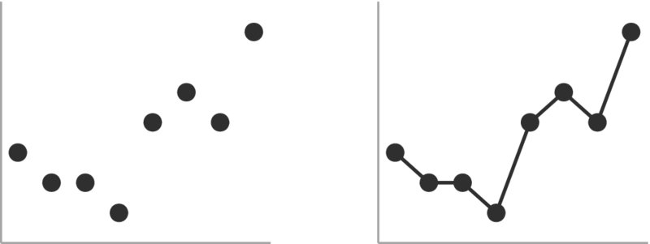
                

            

        

    

</section>

---

<section>
    

    

        <h1>Principios de diseño y narrativa visual para comunicar patrones, tendencias y anomalías.</h1>
        <h3>Knaflic (2015)</h3>
    

        

            

                

                    <ul>
                        <li>Comprender el contexto.</li>
                        <li>Elegir una visualización efectiva.</li>
                        <li>Eliminar el desorden.</li>
                        <li><strong>Enfocar la atención de la audiencia.</strong></li>
                        <li>Pensar como un/a Diseñador/a.</li>
                        <li>Contar una historia.</li>
                    </ul>
                

            

            

                

                        <ul>
                            <li>Quién (Su Audiencia)</li>
                            <li>Qué (Acción)</li>
                            <li>Cómo (Mecanismo y Tono)</li>
                            <ol data-marpit-fragment="2">
                                <li>La historia de 3 minutos</li>
                                <li>La Gran idea</li>
                                <li>Storyboarding</li>
                            </ol>
                        </ul>
                    

                

            

        

    

</section>

---

